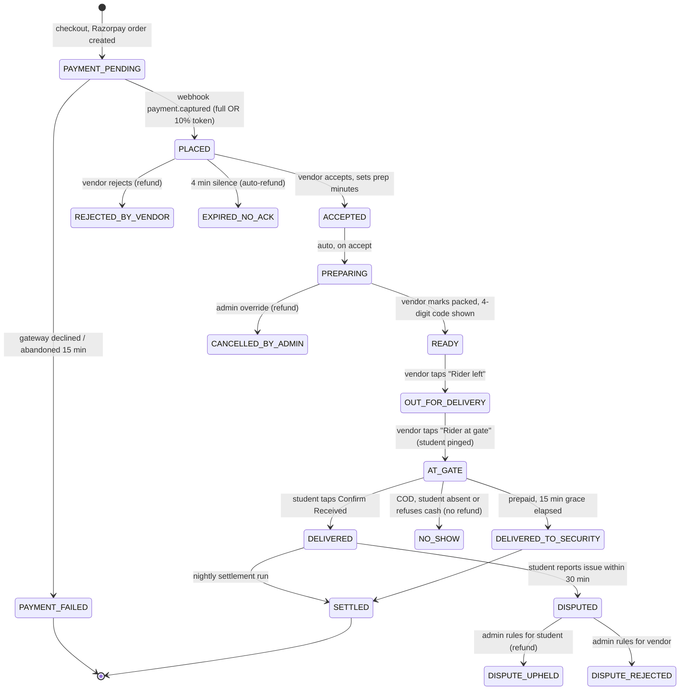

# TREFOOD — System Architecture & End-to-End Flows

> Governed by [DECISIONS.md](DECISIONS.md). Money rules live in
> [MONEY_AND_SETTLEMENT.md](MONEY_AND_SETTLEMENT.md). Failure handling lives in
> [FAILURES_AND_EDGE_CASES.md](FAILURES_AND_EDGE_CASES.md).

---

## 1. Architecture Overview

```
   ┌─────────────────────┐  ┌─────────────────────┐  ┌─────────────────────┐
   │   STUDENT PWA       │  │   VENDOR CONSOLE    │  │   ADMIN CONSOLE     │
   │   mobile-first      │  │   tablet / desktop  │  │   desktop only      │
   │   installable       │  │   audio order bell  │  │   geofence editor   │
   └──────────┬──────────┘  └──────────┬──────────┘  └──────────┬──────────┘
              │                        │                        │
              └────────────────────────┼────────────────────────┘
                                       │  HTTPS
                          ┌────────────▼─────────────┐
                          │   NEXT.JS 16 APP ROUTER  │
                          │  ┌────────────────────┐  │
                          │  │ Server Components  │  │  read paths
                          │  │ Server Actions     │  │  write paths
                          │  │ Route Handlers     │  │  webhooks, cron, push
                          │  └────────────────────┘  │
                          │  ┌────────────────────┐  │
                          │  │  SERVICE LAYER     │  │  <- all business rules
                          │  │  pricing · orders  │  │     live here, never
                          │  │  settlement · auth │  │     in components
                          │  └────────────────────┘  │
                          └───┬──────┬──────┬────┬───┘
                              │      │      │    │
          ┌───────────────────┘      │      │    └──────────────────┐
          │                          │      │                       │
   ┌──────▼───────┐  ┌───────────────▼──┐ ┌─▼──────────────┐ ┌──────▼───────┐
   │ MONGODB      │  │ SUPABASE         │ │ RAZORPAY       │ │ SENTRY +     │
   │ ATLAS        │  │ · Auth (Google)  │ │ · Orders API   │ │ POSTHOG      │
   │ all domain   │  │ · Storage (imgs) │ │ · Refunds API  │ │              │
   │ data         │  │                  │ │ · Webhooks     │ │              │
   └──────────────┘  └──────────────────┘ └────────────────┘ └──────────────┘

   NO rider app.  NO rider GPS.  NO Google Maps.  (see DECISIONS.md §2)
```

### Why each boundary sits where it does

| Concern | Home | Reason |
| :-- | :-- | :-- |
| Identity | Supabase Auth | Google OAuth for free, JWT that Next.js middleware can verify cheaply. |
| Domain data | MongoDB Atlas | Flexible menus, embedded price snapshots, GeoJSON zones in one document. |
| Images | Supabase Storage | Keeps the 512 MB Mongo tier for documents only. Mongo stores the URL string. |
| Business rules | `src/server/services/**` | Server Actions and Route Handlers are thin adapters. Rules are testable without HTTP. |
| Money math | `src/server/services/pricing.ts` | Exactly one function computes a price. Cart preview and order creation call the *same* function. |

---

## 2. Roles & Access Control

| Role | Gets | Cannot |
| :-- | :-- | :-- |
| `STUDENT` | Browse, order, track, confirm receipt, raise dispute | See other students, see vendor payouts |
| `VENDOR_STAFF` | Own order board, 86-toggle, dispatch | Edit prices, see payouts |
| `VENDOR_OWNER` | Everything staff has + menu prices, payout statements | Touch other restaurants |
| `ADMIN` | Campus config, vendor KYC, dispute rulings, manual cancel | Change commission below the campus floor |
| `SUPER_ADMIN` | Everything, including commission overrides and audit log export | — |

**Enforcement is layered.** Middleware gates the route group; every Server Action
re-checks the role *and* the resource ownership (`order.restaurantId === session.restaurantId`).
Never trust a client-supplied `restaurantId`.

---

## 3. The Order State Machine



### Transition table — who may fire what

| From → To | Actor | Guard |
| :-- | :-- | :-- |
| `PAYMENT_PENDING → PLACED` | Razorpay webhook **only** | Valid HMAC signature; amount matches `expectedOnlineAmount`; event not already processed |
| `PLACED → ACCEPTED` | Vendor | Order belongs to vendor; within ack window; prep minutes 5–60 |
| `PLACED → EXPIRED_NO_ACK` | Cron | `now − placedAt > 240s` and still `PLACED` |
| `READY → OUT_FOR_DELIVERY` | Vendor | Gate code generated and displayed |
| `OUT_FOR_DELIVERY → AT_GATE` | Vendor | Fires student push + the grace timer |
| `AT_GATE → DELIVERED` | **Student** | Student owns the order; enters/confirms the 4-digit packet code |
| `AT_GATE → DELIVERED` | Vendor (COD fallback) | Vendor confirms rider returned with the correct cash |
| `* → CANCELLED_BY_ADMIN` | Admin | Written reason mandatory; audit-logged |

> **Every transition writes an `auditLogs` entry** with `{orderId, from, to, actorId,
> actorRole, reason, at}`. This is append-only. Never update or delete an audit row.

---

## 4. Flow A — Student Places an Order

```
1. LAND
   Student opens trefood.in -> campus auto-selected from last visit
   or picked from a list. No login required to browse.

2. PICK DELIVERY POINT   <-- happens BEFORE browsing, not at checkout
   Sticky header: "Deliver to: Ganga Boys Hostel - Main Gate"
   This filters which restaurants are even shown, because vendors
   declare which zones they serve.

3. BROWSE
   Open restaurants first, closed ones greyed at the bottom.
   Each card: name, cuisine, prep time, min order, veg/non-veg.
   Items marked isAvailable=false are visibly struck through, not hidden --
   students should see the item exists and is out today.

4. CART
   One restaurant per cart, enforced hard. Adding from a second
   restaurant prompts "Clear cart and start over?"

5. CURFEW GUARD              <-- runs before checkout is allowed
   estimatedArrival = now + prepTime + campus.transitMinutes
   IF estimatedArrival > (zone.curfewTime - 10 min)
      -> block this zone, offer the 24x7 main gate instead

6. LOGIN (first time only)
   Google sign-in. Then a one-time form: name + phone number.
   Phone is stored on the user profile and reused forever.

7. PAYMENT CHOICE
   [ Pay Online ₹231 ]     -> full amount
   [ Cash on Delivery ]    -> pay ₹24 now, ₹202 cash at the gate
   COD is hidden entirely if user.codBlocked === true.

8. PAY
   Razorpay Checkout opens. Order is created in Mongo as
   PAYMENT_PENDING *before* the gateway opens, so an abandoned
   payment leaves a traceable record.

9. TRACK
   Status stepper polls every 8s. No map, no moving dot.
   ETA countdown from acceptedAt + prepTime + transit.
```

---

## 5. Flow B — Vendor Fulfils an Order

```
NEW ORDER LANDS
  -> Order board polls every 5s
  -> Looping audio chime + browser notification + red full-card flash
  -> A 3:00 countdown ring starts on the card

VENDOR TAPS [ACCEPT] and picks prep time (15 / 20 / 30 / custom)
  -> chime stops, order moves to the PREPARING column
  -> KOT auto-prints (58mm/80mm thermal) or shows a print sheet

KITCHEN COOKS
  -> Ingredient runs out? Tap the item -> "86 this item"
     (marks it unavailable for ALL future orders instantly,
      and opens the substitution flow for THIS order - see failures doc)

FOOD PACKED -> [MARK READY]
  -> System reveals the 4-DIGIT GATE CODE in huge type: 4 8 2 1
  -> Staff writes it on the packet with a marker, or it prints on the label
  -> Student is NOT shown this code yet

RIDER LEAVES -> [RIDER DISPATCHED]
  -> student status becomes "On the way"

RIDER REACHES GATE -> [RIDER AT GATE]     <-- the critical tap
  -> student gets a high-priority push: "Your order is at Ganga Gate 1"
  -> student app NOW reveals the expected code 4821
  -> 15-minute grace timer starts

STUDENT CONFIRMS
  -> order closes itself. Vendor sees it drop off the active board.
```

**The vendor board is the only real-time surface that matters.** A missed order is
lost revenue and a broken promise, so it is defended three ways: polling (not
websockets, which die on serverless), an audio loop that only stops on interaction,
and a visible "connection lost" banner if a poll fails twice in a row.

---

## 6. Flow C — The Gate Handoff Protocol (D4)

This is the mechanism that replaces a rider app entirely.

```
        VENDOR SIDE                          STUDENT SIDE
   ┌─────────────────────┐             ┌─────────────────────┐
   │ MARK READY          │             │                     │
   │ code generated 4821 │             │  status: Cooking    │
   │ written on packet   │             │                     │
   └──────────┬──────────┘             └─────────────────────┘
              │
   ┌──────────▼──────────┐             ┌─────────────────────┐
   │ RIDER AT GATE  tap  │────push────▶│  🔔 ORDER AT GATE   │
   └─────────────────────┘             │  Expected code:     │
                                       │      4 8 2 1        │
                                       │  ⏱ 14:32 remaining  │
                                       └──────────┬──────────┘
                                                  │
                              student walks to the gate,
                              reads the code on the packet,
                              compares it to the screen
                                                  │
                                       ┌──────────▼──────────┐
                                       │ codes match?        │
                                       │ COD: hand over ₹202 │
                                       │ [CONFIRM RECEIVED]  │
                                       └──────────┬──────────┘
                                                  │
                                            DELIVERED
```

### Why the code direction is inverted from the original design

The original plan had the **rider** type the student OTP. That requires the rider to
hold a working, charged, connected phone — which you confirmed they often do not.

Inverting it costs nothing in fraud terms and gains everything in reliability:

- The code is **physically on the packet**, so a student cannot confirm an order that
  never arrived — they would have no code to match.
- The student already has a phone, is already logged in, and is already standing there.
- It works at 2 AM in the rain with a rider who owns a ₹900 keypad phone.

**Anti-fraud note:** the code is revealed to the student only at `AT_GATE`. A student
cannot pre-confirm from their room, because until the vendor taps *Rider at gate* the
confirm button does not exist. And confirming early only hurts the student — it
releases the order before they hold the food.

---

## 7. Data Model (MongoDB collections)

| Collection | Purpose | Key indexes |
| :-- | :-- | :-- |
| `campuses` | Campus, geofence polygon, delivery zones, all pricing settings | `slug` unique |
| `users` | Profile mirror of Supabase auth: role, phone, campus, `codBlocked` | `authId` unique, `phone` |
| `restaurants` | Vendor, KYC, bank details, served zones, prep time, fees | `campusId + isOpen`, `slug` unique |
| `menuCategories` | Ordered sections | `restaurantId + sortOrder` |
| `menuItems` | Items, add-on groups, `isAvailable` 86-flag | `restaurantId + isAvailable` |
| `orders` | The whole order, with a **frozen price snapshot** | `orderNumber` unique, `customerId + createdAt`, `restaurantId + status`, `status + placedAt` (for cron) |
| `coupons` | Codes, caps, per-student usage | `code` unique |
| `ledgerEntries` | Every payout adjustment, append-only | `restaurantId + createdAt` |
| `settlements` | One immutable row per vendor per day | `restaurantId + settlementDate` **unique** |
| `webhookEvents` | Razorpay event IDs already processed | `eventId` unique |
| `auditLogs` | Append-only transition trail | `orderId + at`, `actorId + at` |
| `pushSubscriptions` | Web Push endpoints per device | `userId` |
| `disputes` | Student complaints, photos, admin ruling | `orderId` unique, `status` |

### The order document, annotated

```typescript
interface IOrder {
  _id: ObjectId;
  orderNumber: string;              // "TRF-NITP-8921" — human-quotable at the gate
  campusId: ObjectId;
  restaurantId: ObjectId;
  customerId: ObjectId;

  // Snapshots: copied at creation, NEVER joined at read time.
  // A restaurant renaming itself must not rewrite last month's orders.
  customerSnapshot: { name: string; phone: string };
  restaurantSnapshot: { name: string; phone: string };
  deliveryZoneSnapshot: {
    zoneId: string; name: string; zoneType: string;
    curfewTime?: string; instructions?: string;
  };

  items: Array<{
    itemId: ObjectId; name: string; isVeg: boolean;
    quantity: number; unitPricePaise: number;
    addOns: Array<{ name: string; pricePaise: number }>;
    lineTotalPaise: number;
  }>;

  // Every field below is integer paise. See MONEY_AND_SETTLEMENT.md
  pricing: {
    subtotalPaise: number;
    packagingFeePaise: number;
    deliveryFeePaise: number;
    discountPaise: number;
    commissionBasePaise: number;
    commissionPct: number;             // 10, snapshotted in case it changes later
    platformCommissionPaise: number;
    vendorReceivablePaise: number;
    convenienceFeePaise: number;       // NON-REFUNDABLE
    grandTotalPaise: number;
    refundableAmountPaise: number;
  };

  payment: {
    method: "ONLINE_100" | "HYBRID_COD";
    status: "PENDING" | "CAPTURED" | "FAILED" | "REFUNDED" | "PARTIALLY_REFUNDED";
    razorpayOrderId?: string;
    razorpayPaymentId?: string;
    onlinePaidPaise: number;
    cashDueOnDeliveryPaise: number;
    cashCollected?: boolean;           // COD only, set at handoff
  };

  status: OrderStatus;                 // see the FSM above
  gateCode: string;                    // 4 digits, revealed to student only at AT_GATE
  prepMinutes?: number;

  timestamps: {
    createdAt: Date; placedAt?: Date; acceptedAt?: Date;
    readyAt?: Date; dispatchedAt?: Date; atGateAt?: Date;
    deliveredAt?: Date; settledAt?: Date;
  };

  cancellation?: { reason: string; by: "VENDOR" | "ADMIN" | "SYSTEM"; at: Date };
  refund?: { razorpayRefundId: string; amountPaise: number; status: string; at: Date };
}
```

**On snapshots:** every `*Snapshot` field exists so an order is a self-contained
historical record. Reading a six-month-old order must never depend on a restaurant,
zone, or user document still existing or still holding the same values.

---

## 8. Realtime, Notifications & Maps

### Realtime → interval polling, deliberately

Supabase Realtime watches Postgres rows; the orders live in MongoDB, so it would emit
nothing. Websockets on serverless die at the function timeout. Polling is therefore
not a compromise here, it is the correct answer at this scale:

| Surface | Interval | Stops when |
| :-- | :-- | :-- |
| Vendor order board | 5 s | tab hidden (`visibilitychange`) |
| Student order tracker | 8 s | order reaches a terminal state |
| Admin live radar | 10 s | tab hidden |

At 200 orders/day this is a trivial query load, and it survives phone sleep, tunnel
Wi-Fi, and cold starts — all of which kill a socket.

### Notifications

| Channel | Use | Cost |
| :-- | :-- | :-- |
| **Web Push (VAPID)** | Order accepted, at gate, cancelled | ₹0 |
| **In-app toast + audio** | Vendor new-order alert | ₹0 |
| **Browser Notification API** | Vendor board when tab is backgrounded | ₹0 |
| **SMS / WhatsApp** | Deferred until DLT clears (D7) | per message |

> iOS caveat: Web Push works on iOS 16.4+ **only after the PWA is added to the home
> screen**. The install prompt is therefore a feature, not a nicety — show it after
> the first successful order, when intent is highest.

### Maps → Leaflet + OpenStreetMap

Used in exactly two places, neither of which needs a paid tier:

1. **Admin geofence editor** — `leaflet-draw` to trace the campus polygon and drop
   delivery-zone pins.
2. **Student gate pin** — a static marker showing where to collect. No routing, no
   live position, no directions API.

---

## 9. Progressive Web App

- `manifest.json`: standalone display, portrait, brand theme colour, maskable icons.
- Service worker caches the app shell, menu images, and the campus/restaurant lists.
- **Never cache order state.** A stale "Cooking" screen when the rider is at the gate
  is worse than a spinner. Order reads are always network-first.
- Offline fallback page: "You are offline — your placed orders are safe."
- Install prompt deferred until after the first delivered order.

---

## 10. Security Requirements

1. **Webhook signature verification** on every Razorpay call, using
   `crypto.timingSafeEqual`. Reject unsigned requests with 400 before parsing.
2. **Webhook idempotency**: insert `eventId` into `webhookEvents` with a unique index
   *before* acting. A duplicate key error means already processed — return 200 and stop.
3. **Never trust client-sent prices.** The cart posts item IDs and quantities only.
   The server recomputes every rupee from the database.
4. **Gate codes are server-generated**, never predictable from the order number, and
   returned to the student only when `status === AT_GATE`.
5. **Rate limits**: order creation 5/min/user, coupon validation 10/min/user, login
   10/hour/IP.
6. **Audit everything financial**: price edits, commission overrides, manual
   cancellations, dispute rulings, settlement runs.
7. **Cron routes are protected** by a shared secret header, not just obscurity.
